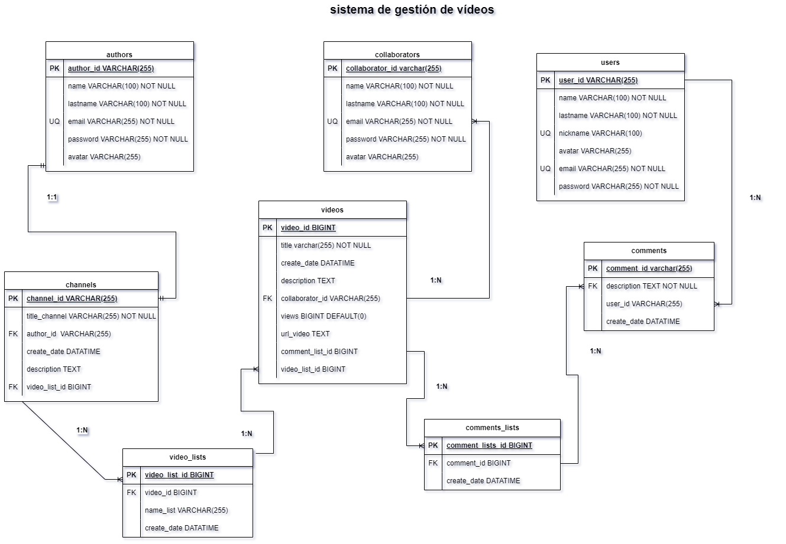

# sistema de gestión de videos.

##  Listado de Entidades 

### authors **(ED)**
- author_id **(PK)**
- name
- lastaname 
- email **(UQ)**
- password
- avatar
### users **(ED)**
- author_id **(PK)**
- name
- lastaname 
- nikname **(UQ)**
- email **(UQ)**
- password
- avatar
### collaborators **(ED)**
- author_id **(PK)**
- name
- lastaname 
- email **(UQ)**
- password
- avatar
### channels **(ED)**
- channel_id **(PK)**
- title_channel
- author_id **(FK)**
- description
- video_list_id **(FK)**
### videos **(ED)**
- video_id **(PK)**
- title
- create_date
- description
- collaborator_id **(FK)**
- views
- url_video
- comment_list_id **(FK)**
- category_id **(FK)**
### comments **(ED)**
- comment_id **(PK)**
- user_id **(FK)**
- create_date
### categories **(EC)**
- category_id **(PK)**
- name_category
- description
### video_lists**(ED)**
- video_list_id **(PK)**
- video_id **(FK)**
- name_list 
- create_date
### comments_lists**(ED)**
- comment_list_id **(PK)**
- comment_id **(FK)**
- create_date
## Relaciones
1. 
## Modelo Entidad-Relación

## Glosario

- **ED**:Entidad de datos.
- **EC**: Entidad de catálago.
- **FK**:Foreign key.
- **PK**:Primary key.
- **1:1**:uno a uno.
- **1:N**:uno a muchos.
- **N:M**:muchos a muchos.